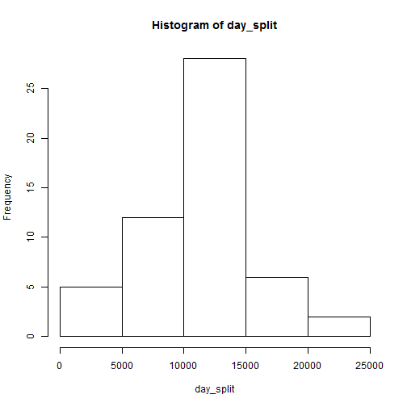
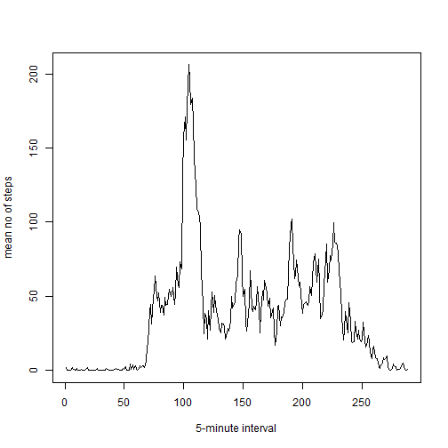
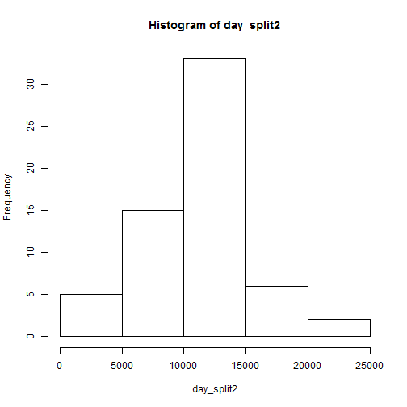
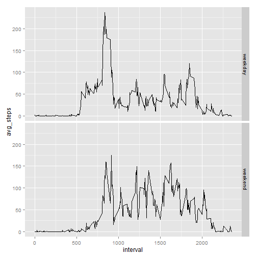

## Loading and preprocessing the data


```r
step_data=read.csv("activity.csv")
step_data["date"]=as.Date(step_data$date)
```

## What is mean total number of steps taken per day?


```r
day_split=sapply(split(step_data$steps,step_data$date),sum)
hist(day_split)
```

 

Mean and median are as follows:


```r
mean(day_split,na.rm=TRUE)
```

```
## [1] 10766.19
```

```r
median(day_split,na.rm=TRUE)
```

```
## [1] 10765
```

## What is the average daily activity pattern?


```r
interval_split=sapply(split(step_data$steps,step_data$interval),mean,na.rm=TRUE)
plot(interval_split,type="l",ylab="mean no of steps",xlab="5-minute interval")
```

 

The interval at which mean steps taken is maximal is as follows:


```r
which.max(interval_split)
```

```
## 835 
## 104
```

## Imputing missing values


```r
sum(is.na(step_data$steps))
```

```
## [1] 2304
```

My imputation strategy is as follows: for each (weekday, interval) pair, 
the average number of steps is calculated, excluding missing values.

Each missing value is then replaced by the mean number of steps corresponding to 
the (weekday, interval) pair associated with the missing value.


```r
interval_avg=ave(step_data$steps,step_data$interval, weekdays(step_data$date),FUN=function(x) {mean(x,na.rm=TRUE)})
step_data2=step_data
step_data2[is.na(step_data2$steps),"steps"]=interval_avg[is.na(step_data2$steps)]

day_split2=sapply(split(step_data2$steps,step_data2$date),sum)
hist(day_split2)
```

 

Mean and median are as follows:


```r
mean(day_split2,na.rm=TRUE)
```

```
## [1] 10821.21
```

```r
median(day_split2,na.rm=TRUE)
```

```
## [1] 11015
```

Both mean and median are slightly larger after including imputed values.

## Are there differences in activity patterns between weekdays and weekends?


```r
weekend=function(date) {
    day=weekdays(date)
    return(day %in% c("Saturday", "Sunday"))
}
step_data2["wkend"]=factor(weekend(step_data2$date),labels=c("weekday","weekend"))

aggregate_steps=aggregate(step_data2$steps,by=list(step_data2$interval,step_data2$wkend),mean)
colnames(aggregate_steps)=c("interval","wk_part","avg_steps")
library(ggplot2)
qplot(interval,avg_steps,data=aggregate_steps,geom="line",facets=wk_part ~ .)
```

 
